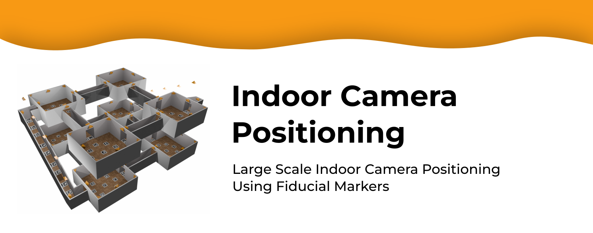

## Overview
This project introduces a novel approach to estimating the pair-wise relationship between nearby cameras using fiducial markers. It then performs a full optimization incorporating real-world information to refine the results further.


## Abstract
Accurately mapping the position of a large set of fixed indoor cameras is crucial for applications in augmented reality, autonomous navigation, video surveillance, and logistics. Current methods are limited by their dependence on distinct environmental features, large overlapping camera views, and specific conditions. Our approach utilizes fiducial markers to estimate the pair-wise relationship between nearby cameras, followed by a full optimization that incorporates real-world information to refine the results. We validate our method using both artificial and real datasets with varying complexity levels. Our experiments demonstrate superior performance over existing state-of-the-art techniques, with increased effectiveness in real-world applications. This repository includes the code, tutorials, and application framework to support the deployment of our methodology.

## Tutorials 📚
*Coming soon!*

## Download 📥
We provide the research community with access to our code, datasets, and resources to support further exploration:

- [Download the code](https://sourceforge.net/projects/indoor-camera-positioning/) - Developed using C++, OpenCV, CMake, and QT Creator.
- [Access the datasets](https://sourceforge.net/projects/indoor-camera-positioning-data/) - Includes both real and artificial datasets, along with the resources needed for the generation of the artificial datasets in **Blender**.

## Citing 📄
If you use this library in your research, please cite:

```
@Article{s24134303,
AUTHOR = {García-Ruiz, Pablo and Romero-Ramirez, Francisco J. and Muñoz-Salinas, Rafael and Marín-Jiménez, Manuel J. and Medina-Carnicer, Rafael},
TITLE = {Large-Scale Indoor Camera Positioning Using Fiducial Markers},
JOURNAL = {Sensors},
VOLUME = {24},
YEAR = {2024},
NUMBER = {13},
ARTICLE-NUMBER = {4303},
URL = {https://www.mdpi.com/1424-8220/24/13/4303},
ISSN = {1424-8220},
DOI = {10.3390/s24134303}
}
```

## License
This software is licensed under the MIT License.

## Contact 📧
For further questions, please contact:
- **Pablo García-Ruiz**: pgruiz@uco.es
Please support my career through my [Github](https://github.com/pabgaru) and [YouTube](https://www.youtube.com/channel/UChmAOYqpthYZoGQ8GW4u2kQ) profiles.

## Related Projects 🔗
- [Marker Mapper](https://www.uco.es/investiga/grupos/ava/portfolio/marker-mapper/)
- [ArUco](https://www.uco.es/investiga/grupos/ava/portfolio/aruco/)


## Getting Started 🚀
For more details, visit the [Indoor Camera Positioning project page](https://www.uco.es/investiga/grupos/ava/portfolio/indoor-camera-positioning/).
